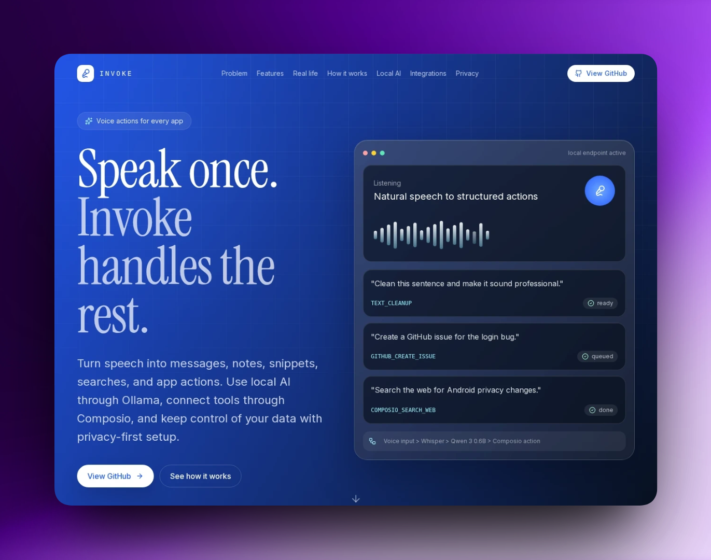
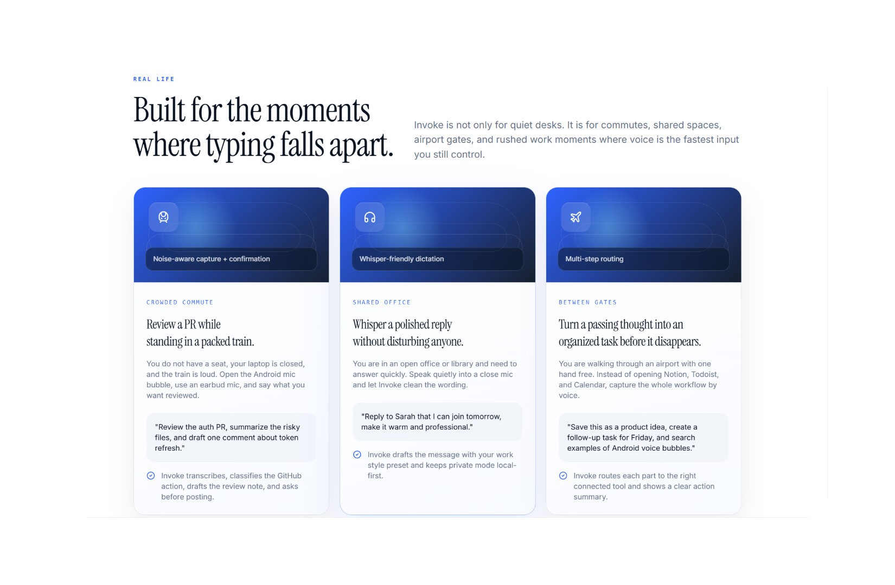

# Invoke

## Voice actions from your phone

Invoke is an Android-first voice command layer that turns natural speech into useful actions: clean a sentence, draft a reply, create a task, search the web, or prepare a GitHub issue without jumping between apps.

This repository contains the hackathon submission scope only:

- `android/` - Kotlin Android app with a floating voice bubble concept, onboarding, privacy controls, local model settings, and action routing clients.
- `frontend/` - Next.js landing page for explaining the product, workflow, integrations, and use cases.

The desktop/Tauri app is intentionally not included in this repository push.

**Landing page:** <https://invokeff.vercel.dev/>  
**Repository:** <https://github.com/devdotzo/invoke>  
**Hackathon:** <https://figural.world/sidehustlehack>

---



---

## Hackathon Fit

Invoke is prepared for Figural Side Hustle Hack. Figural describes itself as "the layer that decides what to build next", and this submission focuses on a concrete side-hustle product: a mobile assistant that helps people act on ideas and work messages the moment they appear.

The project answers one problem:

> Voice should not only write words. Voice should trigger outcomes.

Instead of another dictation tool, Invoke treats speech as a command bar for real workflows. The Android app gives users a quick mic entry point, local-first setup, and structured action routing. The landing page explains the product clearly for judges, builders, and early users.

---

## Origin Story

I was in Bangalore last week for the Codex hackathon and YC Startup School, and I kept noticing people using Wispr Flow everywhere: inside auto rides, during hackathon work sessions, on buses, and in quick in-between moments where typing was awkward.

I tried it myself and understood why people liked it. The experience was smooth, fast, and genuinely useful. But I also noticed that high-quality speech-to-text workflows are often paid, and I started asking a simple question: why does useful voice input have to be expensive, especially when local models are getting good enough to run personal workflows?

When the Figural Side Hustle Hack appeared, that question turned into the idea for Invoke. I researched small local models and found a practical path with Whisper-style speech-to-text and Qwen 3 0.6B for intent routing. Then Composio made the idea more powerful: voice should not stop at transcription, it should connect to real app actions.

The build came together quickly. I used Anything for coding support, downloaded the generated project ZIP, changed the configuration by hand, wired the mobile app and landing page into shape, and got the workflow running. The tooling was very smooth to work with, and it helped turn the idea from a question into a working hackathon submission.

---

## What Invoke Does

- Turns spoken requests into structured actions.
- Lets users clean rough dictation into usable writing.
- Saves reusable snippets, names, project terms, and style preferences.
- Supports local model routing through an Ollama endpoint.
- Connects action intent to external tools through Composio-ready clients.
- Gives mobile users a floating voice bubble for fast capture.
- Keeps privacy mode and local setup visible in onboarding.

---



---

Example commands:

```text
"Clean this sentence and make it sound professional."
"Create a GitHub issue for the login bug."
"Search the web for Android privacy changes."
"Save this as a product idea and create a follow-up task for Friday."
```

---

## Product Flow

```text
Record -> Transcribe -> Classify -> Execute -> Confirm result
```

1. The Android app captures a spoken request.
2. Speech-to-text converts audio into text.
3. A local model endpoint classifies the request into an action.
4. The action client prepares or executes the workflow.
5. Risky actions can be reviewed before being sent or posted.

---

## Android App

The mobile app is built in Kotlin with Material UI components.

Key areas:

- Permission-first onboarding for microphone and accessibility access.
- Floating mic bubble concept for quick capture from anywhere.
- Local model setup for Ollama-compatible endpoints.
- Privacy mode for local-first use.
- Dictionary, style, and snippet settings.
- Agent clients for local model and connected action routing.

### Android Setup

```bash
cd android
./gradlew assembleDebug
adb install app/build/outputs/apk/debug/app-debug.apk
```

For local authentication settings, copy:

```bash
cp local.properties.example local.properties
```

Then fill in development-only values:

```properties
privy.app.id=your-privy-app-id
privy.app.client.id=your-privy-app-client-id
```

Do not commit `android/local.properties`.

---

## Landing Page

The landing page is a Next.js app in `frontend/`.

It explains:

- The problem with app switching and plain dictation.
- Invoke's voice-to-action workflow.
- Real-life mobile use cases.
- Local AI routing through Ollama.
- Composio-style integrations.
- Privacy and user control.

### Frontend Setup

```bash
cd frontend
npm install
npm run dev
```

Build:

```bash
npm run build
```

---

## Tech Stack

| Layer | Technology | Purpose |
| --- | --- | --- |
| Mobile app | Kotlin, Android Views, Material Components | Voice bubble, onboarding, settings, mobile workflow |
| Landing page | Next.js, React, Tailwind CSS | Public product page and hackathon explanation |
| Local model route | Ollama-compatible endpoint | Intent classification |
| Action routing | Composio-ready client layer | Connected workflow execution |
| Speech layer | Android STT / local STT path | Voice-to-text input |

---

## Local AI Setup

Run Ollama on a computer reachable from the Android phone.

```bash
ollama pull qwen3:0.6b
OLLAMA_HOST=0.0.0.0:11434 ollama serve
```

In the Android app, configure:

```text
Ollama endpoint: <computer-lan-ip>:11434
Model: qwen3:0.6b
```

Use the in-app connection test before relying on the endpoint.

---

## Privacy Notes

- Local model routing can stay on the user's own machine.
- Cloud sync and external integrations are optional.
- API keys, local endpoints, and machine-specific settings are not committed.
- `android/local.properties`, `.env` files, dependency folders, and build outputs are ignored.

---

## Project Structure

```text
Invoke/
├── android/      # Kotlin Android mobile app
├── frontend/     # Next.js landing page
├── public/       # README image assets
├── vercel.json   # Vercel build config for frontend/
├── .gitignore    # Keeps desktop app and generated files out
└── README.md
```

---

## License

MIT

---

**Invoke - mobile voice actions for real workflows.**
